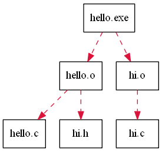

##依赖图：使用 graphviz 绘制

C语言中的Make文件，存在盘根错节的文件依赖关系，可视化它是很好的点子。 graphiviz 做这个，能行。

安装graphviz (自己google)。....

先看一个最简单的图。你只要打开cmd，输入如下命令：

	echo digraph abc{a;b;a-^>b;} >simplest.dot
	dot -Tpng simplest.dot -o 1.png
	1.png

THEN

第一行命令看着不自在，像是针眼画师，看看生成了啥？

	type simplest.dot
	digraph abc{a;b;a->b;}

简洁。你看，要在dot文件中定义节点（这里是a,b),然后定义链接（这里是a->b)。这就是图片的蓝图文件了。

这样，可视化这个[make](GnuMakefile)也就简单。

[蓝图](deps.dot)。

-------------------

### 时间之外的往事

说好要做 windows++ 也没弄。

是这样的。我想把这两个命令合并为一个
就是

      echo digraph abc{a;b;a-^>b;} >simplest.dot
      dot -Tpng simplest.dot -o 1.png

搞成这样的：

      echo digraph abc{a;b;a-^>b;} |  dot -Tpng simplest.dot -o 1.png

实际上不行。因为尽管 "^>" 做了转义(^是转义符号)，但是在有"|"的情况下，cmd断句显然出现了问题。

把dot换成more来调试可以发现管道什么也没有传过来。

      $echo digraph abc{a;b;a-^>b;} |  more

标引可以过来，但是多了”，人家dot不认。

      $echo "digraph abc{a;b;a->b;}" |  more
      "digraph abc{a;b;a->b;}"   

最后，有去看了鬼怪的bat语法，比如FOR命令。太丑陋了，晚上没有睡好。
第二天灯泡时刻突袭了我。带命令一起标引：

      cmd /c "echo digraph abc{a;b;a-^>b;}" |  dot -Tpng  -o 1.png

cmd正确的做了断句。虽然用""做了quoted ,但是 Esc 转义还是必要的。

并且，可读性很好哦。

坑人。原因在于文本得人看得懂，还不能二义，人类的限制。

神对比：

    1. 可以echo
    $cmd /c "echo digraph abc{a;b;a-^>b;}" 
    digraph abc{a;b;a->b;}
    2. 可以more
    $cmd /c "echo digraph abc{a;b;a-^>b;}" |more
    digraph abc{a;b;a->b;}  
    3. 可以echo
    $echo digraph abc{a;b;a-^>b;} 
    digraph abc{a;b;a->b;}
    4. 不能more
    $echo digraph abc{a;b;a-^>b;} |more

到处都是坑的BAT。  

WINDOWS++ ,我来了。
####dot命令是什么？
     graphviz的命令行版本
####如何知道dot命令支持标准输入？
把

     dot -Tpng simplest.dot -o 1.png     
改成

     dot -Tpng  -o 1.png
它就会等你在stdin内录入文件内容并ctrl+z，这就可以说明了。

这样的坑，来自于，我总是不想写这样的口水话：“保存以下文本为 simplest.dot,然后执行blabla...” 。所以，这是自找的。

-----

###more tricks 

How do I create a multiline text file with Echo in Windows command prompt?

There are three ways.
Append each line using >>:
C:\Users\Elias>echo foo > a.txt
C:\Users\Elias>echo bar >> a.txt

Use parentheses to echo multiple lines:
C:\Users\Elias>(echo foo
More? echo bar) > a.txt

Type caret (^) and hit ENTER twice after each line to continue adding lines:
C:\Users\Elias>echo foo^
More?
More? bar > a.txt

All the above produce the same file:
C:\Users\Elias>type a.txt
foo
bar

C:'>copy con SN.txt
Product Key: TJQAW-VG29Y-G194Y-E7KRT-BYH9G

^Z
 1 file(s) copied.

